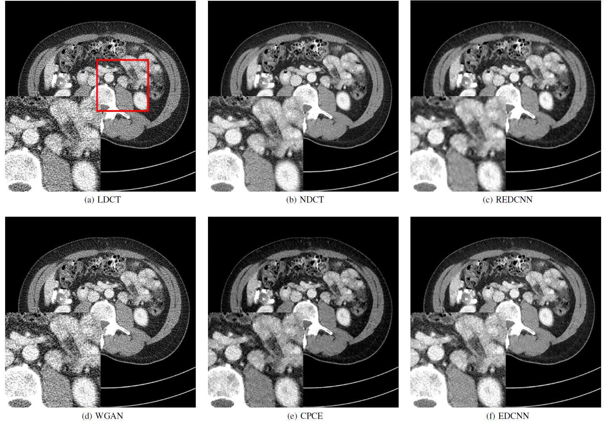
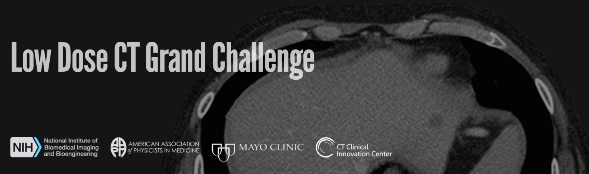

# EDCNN: Edge enhancement-based Densely Connected Network with Compound Loss for Low-Dose CT Denoising

By [Tengfei Liang](https://github.com/workingcoder),  [Yi Jin](https://scholar.google.com/citations?user=NQAenU0AAAAJ&hl=en&oi=sra),  [Yidong Li](https://scholar.google.com/citations?hl=en&user=3PagRQEAAAAJ), [Tao Wang](https://scholar.google.com/citations?user=F3C5oAcAAAAJ&hl=en&oi=sra).

This repository is an official implementation of the paper [EDCNN: Edge enhancement-based Densely Connected Network with Compound Loss for Low-Dose CT Denoising](https://arxiv.org/abs/2011.00139). [`ArXiv`](https://arxiv.org/abs/2011.00139) [`IEEEXplore`](https://ieeexplore.ieee.org/document/9320928)

*Notes:*

This repository provides [model and loss implementation code](./code), which can be easily integrated into the user's project.


## Introduction

EDCNN is a new end-to-end Low-Dose CT Denoiser. Designed as the FCN structure, it can effectively realize the low-dose CT image denoising in the way of post-processing. With the noval edge enhancement module, densely connection and compound loss, the model has a good performance in preserving details and suppressing noise in this denoising task. (For more details, please refer to [the original paper](https://arxiv.org/abs/2011.00139))

<br/>
<div align="center">
  

  Fig. 1: Overall architecture of the proposed EDCNN model.
</div>


## Denoised results

For fairness, we choose the [REDCNN](https://arxiv.org/abs/1702.00288), [WGAN](https://arxiv.org/abs/1708.00961) and [CPCE](https://arxiv.org/abs/1802.05656) for comparison, because of their design of the single model, which is the same as our [EDCNN](https://arxiv.org/abs/2011.00139) model. All these models adopt the structure of convolutional neural networks.

<br/>
<div align="center">
  

  Fig. 2: Comparison with existing Models on the AAPM-Mayo Dataset.
</div>


## AAPM-Mayo dataset

In the experiment of our study, we utilize the dataset of the [2016 NIH AAPM-Mayo Clinic Low-Dose CT Grand Challenge](https://www.aapm.org/grandchallenge/lowdosect/), which is used by current mainstream methods in the field of low-dose CT image denoising. It contains the paired normal-dose CT (NDCT) images and synthetic quarter-dose CT images (LDCT) with a size of 512x512 pixels, collected from 10 patients. So there are LDCT images for inputs of the model and NDCT images as targets, which can support the supervised training process. [`Download`](https://www.dropbox.com/sh/txplswleuxgrdue/AABD_1W7-SKdXuZD4myvC2Hqa?dl=0)

<br/>
<div align="center">
  
</div>


## Citing EDCNN
If you find EDCNN useful in your research, please consider citing:
```bibtex
@article{Liang_2020,
   title={EDCNN: Edge enhancement-based Densely Connected Network with Compound Loss for Low-Dose CT Denoising},
   ISBN={9781728144801},
   url={http://dx.doi.org/10.1109/ICSP48669.2020.9320928},
   DOI={10.1109/icsp48669.2020.9320928},
   journal={2020 15th IEEE International Conference on Signal Processing (ICSP)},
   publisher={IEEE},
   author={Liang, Tengfei and Jin, Yi and Li, Yidong and Wang, Tao},
   year={2020},
   month={Dec}
}
```


## License

This repository is released under the Apache 2.0 license. Please see the [LICENSE](./LICENSE) file for more information.
